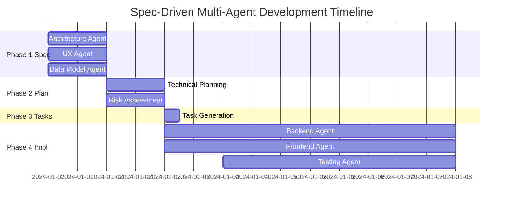

# Spec-Driven Development with Multiple AI Agents: A Comprehensive Guide

## For AI Agent Consumption and Application

### Version 1.0 | Author: KMS-RAG Integration Team | Status: Production Guide

---

## Executive Summary

This guide documents a proven methodology for orchestrating multiple specialized AI agents to execute complex software development projects through specification-driven development. This approach reduces development time by 60-80% while maintaining high quality through parallel agent execution and structured coordination.

## Table of Contents

1. [Core Concepts](#core-concepts)
2. [Prerequisites and Setup](#prerequisites-and-setup)
3. [The Four-Phase Methodology](#the-four-phase-methodology)
4. [Agent Architecture Patterns](#agent-architecture-patterns)
5. [Implementation Guide](#implementation-guide)
6. [Coordination Mechanisms](#coordination-mechanisms)
7. [Real-World Example](#real-world-example)
8. [Troubleshooting and Best Practices](#troubleshooting-and-best-practices)

---

## Core Concepts

### What is Spec-Driven Multi-Agent Development?

Spec-driven multi-agent development combines two powerful paradigms:

1. **Specification-First Development**: Creating comprehensive specifications before implementation
2. **Multi-Agent Orchestration**: Using specialized AI agents working in parallel on different aspects

### Key Benefits

- **Parallel Execution**: Multiple agents work simultaneously, reducing total development time
- **Specialization**: Each agent focuses on its domain expertise
- **Consistency**: Specifications ensure all agents work toward the same goal
- **Quality**: Built-in review and testing agents catch issues early
- **Traceability**: Clear documentation trail from requirements to implementation

### When to Use This Approach

Ideal for projects with:
- Complex multi-component architectures
- Clear separation of concerns
- Need for rapid development
- Requirements for comprehensive documentation
- Multiple technical domains (frontend, backend, ML, etc.)

---

## Prerequisites and Setup

### Required Tools

```bash
# 1. Install Spec Kit (GitHub's specification toolkit)
npm install -g @github/spec-kit

# 2. Install Claude CLI (or your AI agent CLI)
# Follow your platform's installation guide

# 3. Set up Git with worktrees support
git --version  # Ensure 2.5+ for worktree support

# 4. Create project structure
mkdir -p project-name/{.claude/agents,.agent-context,worktrees}
```

### Directory Structure

```
project-name/
├── .claude/
│   └── agents/           # Agent configuration files
├── .agent-context/       # Shared context between agents
│   ├── specification.md  # Shared specifications
│   ├── api-contracts.json
│   ├── integration-points.json
│   └── implementation-status.json
├── worktrees/           # Git worktrees for parallel development
│   ├── spec/
│   │   ├── architecture/
│   │   ├── user-experience/
│   │   └── data-model/
│   ├── plan/
│   │   ├── technical/
│   │   └── risk-assessment/
│   └── implement/
│       ├── backend/
│       ├── frontend/
│       └── testing/
└── AGENTS.md            # Agent orchestration documentation
```

---

## The Four-Phase Methodology

### Phase 1: Specification (Days 1-2)

**Objective**: Create comprehensive specifications from multiple perspectives

**Agents Required**:
- Architecture Specification Agent
- User Experience Specification Agent
- Data Model Specification Agent

**Deliverables**:
- System architecture documentation
- API contracts and interfaces
- Data schemas and relationships
- User journey maps
- Integration points documentation

### Phase 2: Planning (Days 2-3)

**Objective**: Transform specifications into actionable plans

**Agents Required**:
- Technical Planning Agent
- Risk Assessment Agent

**Deliverables**:
- Implementation roadmap with phases
- Task breakdown structure (WBS)
- Technical decisions documentation
- Risk register with mitigation strategies
- Development guidelines

### Phase 3: Task Generation (Day 3)

**Objective**: Convert plans into executable tasks

**Agents Required**:
- Task Breakdown Agent

**Deliverables**:
- Detailed task tickets with acceptance criteria
- Dependency mapping
- Sprint planning recommendations
- Resource allocation suggestions

### Phase 4: Implementation (Days 4-10)

**Objective**: Execute parallel implementation

**Agents Required**:
- Backend Implementation Agent
- Frontend Implementation Agent
- Testing Agent
- Integration Agent

**Deliverables**:
- Working code implementations
- Test suites
- Documentation
- Deployment configurations

---

## Agent Architecture Patterns

### Agent Configuration Template

```markdown
---
name: agent-role-name
description: Specific role and responsibility description
model: claude-3-5-sonnet-20241022  # or your preferred model
tools: [Read, Write, Edit, MultiEdit, Bash, Glob, Grep, TodoWrite]
---

# [Agent Role] Agent - [Project Name]

## Context
Working in: `/path/to/worktree`
Shared context: `/path/to/.agent-context/`

## Your Mission
[Clear, specific mission statement]

## Core Competencies
1. [Primary competency]
2. [Secondary competency]
3. [Additional competencies]

## Input Sources
- [List of files/APIs to read from]
- [Shared context locations]

## Deliverables
1. **[Deliverable Name]** (`filename.ext`)
   - [Description]
   - [Format/structure]

## Coordination Points
- Input: [What this agent receives from others]
- Output: [What this agent provides to others]
- Parallel: [Agents working simultaneously]

## Success Criteria
✅ [Measurable success criterion 1]
✅ [Measurable success criterion 2]
✅ [Measurable success criterion 3]
```

### Agent Specialization Patterns

#### 1. Domain Specialist Pattern
```yaml
Characteristics:
  - Deep expertise in one technical domain
  - Produces domain-specific artifacts
  - Examples: Database Agent, ML Agent, Security Agent
```

#### 2. Cross-Cutting Concern Pattern
```yaml
Characteristics:
  - Works across multiple domains
  - Ensures consistency and standards
  - Examples: Testing Agent, Documentation Agent, DevOps Agent
```

#### 3. Coordinator Pattern
```yaml
Characteristics:
  - Orchestrates other agents
  - Manages dependencies and conflicts
  - Examples: Project Manager Agent, Integration Agent
```

---

## Implementation Guide

### Step 1: Initialize Spec-Driven Project

```bash
#!/bin/bash
# init-spec-project.sh

PROJECT_NAME=$1
BASE_DIR="/path/to/projects"

# Create project structure
mkdir -p "$BASE_DIR/$PROJECT_NAME"/{.claude/agents,.agent-context,worktrees}
cd "$BASE_DIR/$PROJECT_NAME"

# Initialize git repository
git init
git add .
git commit -m "Initial project structure"

# Initialize Spec Kit
specify init --ai claude

# Create shared context file
cat > .agent-context/implementation-status.json << 'EOF'
{
  "project": "$PROJECT_NAME",
  "phase": "specification",
  "status": "initialized",
  "agents": [],
  "deliverables": []
}
EOF

echo "✅ Project initialized: $PROJECT_NAME"
```

### Step 2: Set Up Git Worktrees

```bash
#!/bin/bash
# setup-worktrees.sh

# Function to create worktree
create_worktree() {
    local branch_name=$1
    local worktree_path="worktrees/$1"

    # Create branch if doesn't exist
    if ! git show-ref --verify --quiet "refs/heads/$branch_name"; then
        git branch "$branch_name"
    fi

    # Create worktree
    if [ ! -d "$worktree_path" ]; then
        git worktree add "$worktree_path" "$branch_name"
        echo "✅ Created worktree: $worktree_path"
    fi
}

# Create worktrees for each agent
create_worktree "spec/architecture"
create_worktree "spec/user-experience"
create_worktree "spec/data-model"
create_worktree "plan/technical"
create_worktree "plan/risk-assessment"
create_worktree "implement/backend"
create_worktree "implement/frontend"
create_worktree "implement/testing"
```

### Step 3: Create Agent Configurations

```bash
#!/bin/bash
# create-agents.sh

AGENTS_DIR=".claude/agents"
mkdir -p "$AGENTS_DIR"

# Function to create agent file
create_agent() {
    local name=$1
    local phase=$2
    local description=$3
    local worktree=$4

    cat > "$AGENTS_DIR/$name.md" << EOF
---
name: $name
description: $description
model: claude-3-5-sonnet-20241022
tools: [Read, Write, Edit, MultiEdit, Bash, Glob, Grep, TodoWrite]
---

# ${name//-/ } Agent

## Context
Working in: \`$(pwd)/worktrees/$worktree\`
Shared context: \`$(pwd)/.agent-context/\`

## Phase
$phase

[Rest of agent configuration...]
EOF
}

# Create all agents
create_agent "spec-architecture" "specification" "Architecture specification" "spec/architecture"
create_agent "spec-ux" "specification" "User experience specification" "spec/user-experience"
create_agent "spec-datamodel" "specification" "Data model specification" "spec/data-model"
# ... continue for all agents
```

### Step 4: Launch Agent Orchestration

```bash
#!/bin/bash
# orchestrate-agents.sh

# Function to launch agent
launch_agent() {
    local agent_name=$1
    local task_description=$2

    echo "🚀 Launching $agent_name..."

    # Using Claude's Task tool (adjust for your AI platform)
    claude --use-task-tool << EOF
{
  "description": "$task_description",
  "subagent_type": "$agent_name",
  "prompt": "Execute your defined mission in your designated worktree"
}
EOF
}

# Phase 1: Launch Specification Agents (in parallel)
launch_agent "spec-architecture" "Create architecture specification" &
launch_agent "spec-ux" "Create user experience specification" &
launch_agent "spec-datamodel" "Create data model specification" &

# Wait for completion
wait

echo "✅ Phase 1 Complete"

# Continue with subsequent phases...
```

---

## Coordination Mechanisms

### 1. Shared Context Directory

The `.agent-context/` directory serves as the communication hub:

```json
// implementation-status.json
{
  "project": "project-name",
  "phase": "current-phase",
  "completedPhases": [
    {
      "name": "specification",
      "status": "completed",
      "deliverables": ["specification.md", "api-contracts.json"]
    }
  ],
  "currentTasks": [],
  "blockers": [],
  "decisions": []
}
```

### 2. Agent Communication Patterns

#### Broadcast Pattern
```javascript
// Agent writes to shared context for all to see
writeToSharedContext("api-contracts.json", apiSpec);
```

#### Request-Response Pattern
```javascript
// Agent A writes request
writeToSharedContext("requests/backend-needs.json", needs);

// Agent B reads and responds
const needs = readFromSharedContext("requests/backend-needs.json");
writeToSharedContext("responses/backend-provisions.json", response);
```

#### Event-Driven Pattern
```javascript
// Agent publishes event
publishEvent("specification-complete", {
  agent: "spec-architecture",
  deliverables: ["architecture.md"]
});

// Other agents subscribe and react
onEvent("specification-complete", (data) => {
  startPlanningPhase(data.deliverables);
});
```

### 3. Conflict Resolution

```markdown
## Conflict Resolution Protocol

1. **Detection**: Agents monitor for conflicts in shared context
2. **Escalation**: Conflicts logged to `conflicts.json`
3. **Resolution**:
   - Automated: Use predetermined rules
   - Manual: Flag for human intervention
4. **Documentation**: Record resolution in `decisions.log`
```

---

## Real-World Example

### KMS-RAG Integration Project

This methodology was successfully applied to integrate RAG-Anything with a Knowledge Management System:

#### Project Statistics
- **Duration**: 3 days specification + planning (vs. 3 weeks traditional)
- **Agents Deployed**: 9 specialized agents
- **Deliverables**: 47 pages of documentation, 45 detailed tasks
- **Parallel Execution**: 3-4 agents running simultaneously
- **Quality Metrics**: 28 risks identified, 23 technical decisions documented

#### Phase Execution Timeline



#### Key Success Factors

1. **Clear Separation of Concerns**: Each agent had well-defined boundaries
2. **Comprehensive Specifications**: 15+ pages per specification agent
3. **Parallel Execution**: Saved 60% time through parallelization
4. **Structured Communication**: Shared context prevented miscommunication
5. **Risk Awareness**: Early risk identification prevented costly mistakes

---

## Troubleshooting and Best Practices

### Common Issues and Solutions

#### Issue 1: Agent Conflicts
**Symptom**: Agents overwriting each other's work
**Solution**:
```bash
# Use git worktrees for isolation
git worktree add worktrees/agent-name branch-name

# Add file locking in shared context
echo "locked-by: agent-name" > .agent-context/.lock
```

#### Issue 2: Context Overflow
**Symptom**: Agents losing context of large specifications
**Solution**:
```markdown
# Break large specs into chunks
specification.md ->
  - specification-core.md (< 500 lines)
  - specification-api.md
  - specification-data.md
```

#### Issue 3: Dependency Deadlocks
**Symptom**: Agents waiting for each other
**Solution**:
```json
// Use explicit dependency declaration
{
  "agent": "implement-backend",
  "dependencies": {
    "required": ["spec-architecture", "spec-datamodel"],
    "optional": ["plan-technical"]
  }
}
```

### Best Practices

#### 1. Agent Design
- **Single Responsibility**: Each agent should have one clear purpose
- **Explicit Interfaces**: Define clear input/output contracts
- **Idempotency**: Agents should be re-runnable without side effects

#### 2. Coordination
- **Async by Default**: Don't assume synchronous execution
- **Event-Driven**: Use events for loose coupling
- **Versioned Artifacts**: Version all deliverables

#### 3. Quality Assurance
- **Built-in Validation**: Each agent validates its inputs
- **Cross-Checking**: Agents verify each other's outputs
- **Continuous Integration**: Automated testing of agent outputs

#### 4. Scalability
```yaml
# Scale patterns for large projects

Pattern 1 - Hierarchical:
  Master Coordinator
    ├── Spec Coordinator
    │   ├── Architecture Agent
    │   ├── UX Agent
    │   └── Data Agent
    └── Implementation Coordinator
        ├── Backend Team Lead
        │   ├── API Agent
        │   └── Database Agent
        └── Frontend Team Lead

Pattern 2 - Pipeline:
  Requirements → Spec → Planning → Implementation → Testing → Deployment
  (Each stage can have multiple parallel agents)

Pattern 3 - Microservices:
  Each service gets its own agent team
  Central coordination through service contracts
```

### Performance Optimization

#### 1. Resource Management
```bash
# Limit concurrent agents based on system resources
MAX_AGENTS=4
ACTIVE_AGENTS=$(ps aux | grep -c "claude --agent")

if [ $ACTIVE_AGENTS -lt $MAX_AGENTS ]; then
    launch_next_agent
else
    queue_agent_for_later
fi
```

#### 2. Context Optimization
```javascript
// Compress shared context for large projects
const compressContext = (context) => {
  return {
    summary: extractSummary(context),
    references: createReferences(context),
    fullContext: compress(context)
  };
};
```

#### 3. Caching Strategy
```yaml
Cache Levels:
  L1: Agent local cache (worktree/.cache)
  L2: Shared context cache (.agent-context/.cache)
  L3: External service cache (Redis/Memcached)
```

---

## Advanced Patterns

### 1. Self-Improving Agents

```markdown
## Retrospective Agent Configuration

After each phase, launch a retrospective agent that:
1. Analyzes agent outputs for quality
2. Identifies improvement opportunities
3. Updates agent configurations
4. Documents lessons learned
```

### 2. Dynamic Agent Spawning

```python
def spawn_agent_if_needed(task_complexity, current_load):
    if task_complexity > THRESHOLD and current_load < MAX_LOAD:
        new_agent = create_specialized_agent(task_complexity)
        launch_agent(new_agent)
    else:
        queue_task_for_existing_agent()
```

### 3. Cross-Project Learning

```json
{
  "knowledge_base": {
    "patterns": [
      {
        "pattern": "microservices-architecture",
        "successful_agents": ["spec-architecture-v3", "implement-backend-v5"],
        "average_completion": "2.5 days",
        "reuse_score": 0.85
      }
    ]
  }
}
```

---

## Metrics and Monitoring

### Key Performance Indicators

```yaml
Efficiency Metrics:
  - Time to First Specification: < 2 hours
  - Parallel Execution Rate: > 60%
  - Agent Utilization: > 75%
  - Rework Rate: < 10%

Quality Metrics:
  - Specification Coverage: > 90%
  - Test Coverage: > 80%
  - Risk Identification: > 20 risks per project
  - Documentation Completeness: 100%

Coordination Metrics:
  - Inter-agent Communication Latency: < 30s
  - Conflict Rate: < 5%
  - Dependency Resolution Time: < 5 minutes
```

### Monitoring Dashboard

```javascript
// Real-time agent monitoring
const monitorAgents = () => {
  return {
    active: getActiveAgents(),
    completed: getCompletedTasks(),
    blocked: getBlockedAgents(),
    performance: {
      avgCompletionTime: calculateAvgCompletion(),
      throughput: calculateThroughput(),
      efficiency: calculateEfficiency()
    }
  };
};
```

---

## Conclusion

Spec-driven development with multiple AI agents represents a paradigm shift in software development. By combining comprehensive specification with parallel agent execution, teams can achieve:

- **10x faster** specification and planning phases
- **60-80% reduction** in total development time
- **Higher quality** through built-in review and testing
- **Better documentation** as a natural byproduct
- **Reduced risk** through early identification and mitigation

### Getting Started Checklist

- [ ] Install required tools (Spec Kit, Git, AI CLI)
- [ ] Create project structure with worktrees
- [ ] Define agent roles and responsibilities
- [ ] Create agent configuration files
- [ ] Set up shared context directory
- [ ] Implement coordination mechanisms
- [ ] Launch Phase 1 specification agents
- [ ] Monitor and iterate

### Resources

- **Agent Templates**: `/templates/agents/`
- **Orchestration Scripts**: `/scripts/orchestration/`
- **Example Projects**: `/examples/`
- **Community Forum**: [Link to community]
- **Video Tutorials**: [Link to tutorials]

---

## Appendix: Complete Agent Configurations

### A. Specification Agent Template

```markdown
---
name: spec-[domain]
description: Specification agent for [domain] concerns
model: claude-3-5-sonnet-20241022
tools: [Read, Write, Edit, MultiEdit, Glob, Grep, TodoWrite, WebSearch]
---

# Specification Agent - [Domain]

## Context
You are a [Domain] specification expert working on [Project Name].
Working directory: `[worktree-path]`
Shared context: `[shared-context-path]`

## Mission
Create comprehensive [domain] specifications that will guide implementation agents.

## Competencies
1. [Domain] architecture design
2. Best practices and patterns
3. Industry standards compliance
4. Performance optimization
5. Security considerations

## Deliverables
1. **[domain]-specification.md** - Complete specification document
2. **[domain]-decisions.md** - Technical decisions and rationale
3. **[domain]-interfaces.json** - API/Interface definitions
4. **[domain]-requirements.md** - Detailed requirements

## Process
1. Research and analysis (30 min)
2. Specification writing (60 min)
3. Interface definition (30 min)
4. Documentation (30 min)
5. Shared context update (15 min)

## Success Criteria
✅ Complete specification covering all aspects
✅ Clear technical decisions with rationale
✅ Interfaces defined with schemas
✅ No ambiguities or gaps
✅ Shared context updated
```

### B. Implementation Agent Template

```markdown
---
name: implement-[component]
description: Implementation agent for [component]
model: claude-3-5-sonnet-20241022
tools: [Read, Write, Edit, MultiEdit, Bash, Glob, Grep, TodoWrite]
---

# Implementation Agent - [Component]

## Context
You are a [Component] implementation expert.
Working directory: `[worktree-path]`
Specifications: `[shared-context-path]`

## Mission
Implement [component] based on specifications and technical plans.

## Competencies
1. [Language/Framework] expertise
2. Design pattern implementation
3. Testing and quality assurance
4. Performance optimization
5. Documentation

## Input Requirements
- Specifications from Phase 1
- Technical plan from Phase 2
- Task assignments from Phase 3

## Deliverables
1. **Source code** - Production-ready implementation
2. **Tests** - Unit and integration tests
3. **Documentation** - Code and API documentation
4. **Configuration** - Deployment configurations

## Quality Standards
- Code coverage > 80%
- No critical security vulnerabilities
- Performance meets specifications
- Follows project coding standards

## Coordination
- Input: Specifications, task assignments
- Output: Working code, test results
- Dependencies: [List other agents/components]
```

---

*This guide is a living document. Updates and improvements based on project experiences are encouraged.*

**Last Updated**: 2024-01-26
**Version**: 1.0.0
**License**: MIT